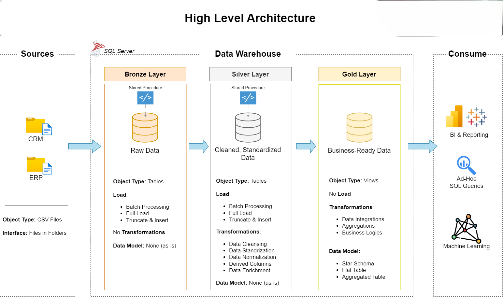

# Modern SQL Data Warehouse Project

### Welcome to the Data Warehouse project repository 🏭
### This project demonstrates a comprehensive data warehousing solution which helps analysts to create reports seamlessly without worry of cleaning the data and updating reports, achieving them to derive actionable insights.
### Designed for best practices in data engineering and analytics.

---

## Data Architecture

The data architecture for this project follows Medallion Architecture **Bronze**, **Silver**, and **Gold** layers:

1. **Bronze Layer**: Stores raw data as it is from the source systems. Data can be ingested in any forms. Here data is ingested from CSV Files into SQL Server Database.
2. **Silver Layer**: This layer includes data cleansing, standardization, and normalization processes to prepare data for analysis. The data from bronze layer is taken, cleaned and loaded as silver layer
3. **Gold Layer**: Business ready transformed data is available in the gold layer, where each data mart components represent dedicated domain areas like sales, procurement, customer, orders etc. which helps data analysts in reporting and analytics

---

## Project Overview

The project steps involves, 

1. **Data Architecture** : Designing a modern data warehouse using Medallion Architecture -- **Bronze**, **Silver**, **Gold** layers.
2. **ETL Pipelines** : These ETL pipelines are the strong foundational pillars for any data architecture, which functions as **E**xtract from source systems, **T**ransforming and **L**oading into the warehouse.
3. **Data Modelling** : Developing fact and dimension tables optimized for better analytical querying.

    

